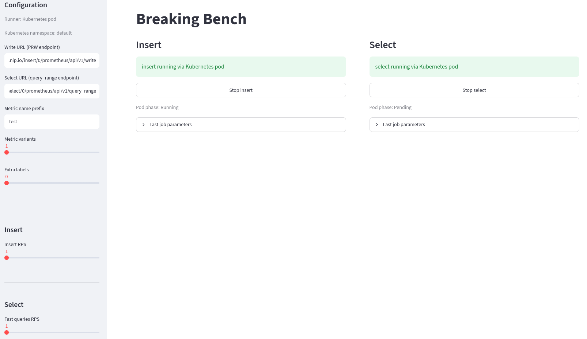

# Breaking Bench

Streamlit controller for running k6 load tests against VictoriaMetrics.



App starts two k6 workloads through selected runner:

- `breaking-bench-k6-insert` writes generated time series through Prometheus remote write.
- `breaking-bench-k6-select` runs query range requests against vmselect.

Workloads use `docker.io/grafana/k6:1.7.1` and k6 automatic extension resolution for `k6/x/remotewrite` and `k6/x/faker`.

## Metrics

Insert workload writes custom metrics with labels:

- `__name__`: generated metric name, such as `test_0`
- `random`: random string generated by faker
- optional `label_N` labels

Select workload reads custom metrics from VictoriaMetrics.

"Fast" query is fetching cachable queries - `<prefix>_<random ID>{foo="bar"}`. "Slow" query is more resource intensive - `rate(<prefix>_<random ID>[1m])`.

## Requirements

- Python 3.11+
- uv
- Podman for local container runner
- kubectl for Kubernetes pod runner
- Network access to VictoriaMetrics `vminsert` and `vmselect`

## Run

```bash
uv run streamlit run app.py
```

Open Streamlit URL shown by command output.

Kubernetes pod runner is default. Pass app arguments after Streamlit `--`:

```bash
uv run streamlit run app.py -- --runtime k8s --k8s-namespace default
uv run streamlit run app.py -- --runtime podman
```

## Configuration

Sidebar fields:

- `Runner`: configured with `--runtime k8s` or `--runtime podman`. Default is `k8s`.
- `Kubernetes namespace`: configured with `--k8s-namespace`. Default is `default`.
- `Write URL`: VictoriaMetrics Prometheus remote write endpoint, for example `/insert/0/prometheus/api/v1/write`.
- `Select URL`: VictoriaMetrics query range endpoint, for example `/select/0/prometheus/api/v1/query_range`.
- `Metric name prefix`: prefix for generated metrics. Metric names become `<prefix>_<index>`.
- `Metric variants`: number of metric names to generate.
- `Extra labels`: number of additional labels named `label_0`, `label_1`, etc.
- `Insert RPS`: insert workload request rate.
- `Fast queries RPS`: request rate for direct metric select queries (`query_metric`).
- `Slow queries RPS`: request rate for range select queries (`query_rate`).

Changing URLs, metric prefix, variants, labels, or RPS while a scenario is running regenerates k6 script and restarts affected workload.

Generated k6 scripts use `constant-arrival-rate` scenarios:

- insert: `main` at `Insert RPS`.
- select: `fast_queries` runs `query_metric` at `Fast queries RPS`.
- select: `slow_queries` runs `query_rate` at `Slow queries RPS`.

Each start or automatic restart logs workload parameters to Streamlit output and shows latest values in `Last job parameters`. Logged rate fields are `fast_rps` and, for select, `slow_rps`. Running workloads refresh the page every 2 seconds so Kubernetes Pod phase stays current.

## Controls

- `Start insert`: starts remote-write workload.
- `Start select`: starts query workload.
- `Stop`: removes corresponding Podman container or Kubernetes Pod and ConfigMap.

Podman container names are reused with `--replace`. Kubernetes runner creates Pods and ConfigMaps named `breaking-bench-k6-insert` and `breaking-bench-k6-select`.

## Development

Type check and syntax check:

```bash
uv run mypy app.py
uv run python -m py_compile app.py
```
