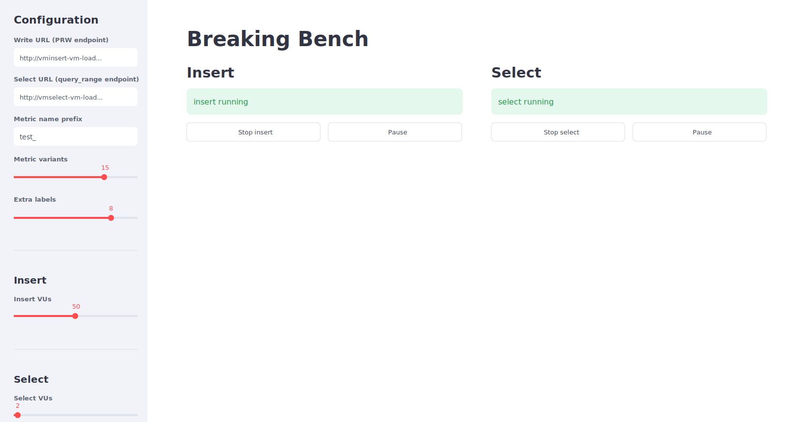

# Breaking Bench

Streamlit controller for running k6 load tests against VictoriaMetrics.



App starts two k6 workloads through selected runner:

- `breaking-bench-k6-insert` writes generated time series through Prometheus remote write.
- `breaking-bench-k6-select` runs query range requests against vmselect.

Workloads use `docker.io/grafana/k6:1.7.1` and k6 automatic extension resolution for `k6/x/remotewrite` and `k6/x/faker`.

## Requirements

- Python 3.11+
- uv
- Podman for local container runner
- kubectl for Kubernetes pod runner
- Network access to VictoriaMetrics `vminsert` and `vmselect`

## Run

```bash
uv run streamlit run app.py
```

Open Streamlit URL shown by command output.

Kubernetes pod runner is default. Pass app arguments after Streamlit `--`:

```bash
uv run streamlit run app.py -- --runtime k8s --k8s-namespace default
uv run streamlit run app.py -- --runtime podman
```

## Configuration

Sidebar fields:

- `Runner`: configured with `--runtime k8s` or `--runtime podman`. Default is `k8s`.
- `Kubernetes namespace`: configured with `--k8s-namespace`. Default is `default`.
- `Write URL`: VictoriaMetrics Prometheus remote write endpoint, for example `/insert/0/prometheus/api/v1/write`.
- `Select URL`: VictoriaMetrics query range endpoint, for example `/select/0/prometheus/api/v1/query_range`.
- `Metric name prefix`: prefix for generated metrics. Metric names become `<prefix>_<index>`.
- `Metric variants`: number of metric names to generate.
- `Extra labels`: number of additional labels named `label_0`, `label_1`, etc.
- `Insert VUs`: insert workload VUs.
- `Select VUs`: select workload VUs.

Changing metric prefix, variants, or labels while a scenario is running regenerates k6 script and restarts affected workload. Changing VUs is applied through k6 REST API without restart for Podman. Kubernetes pods restart only when script configuration changes.

Each start or automatic restart logs workload parameters to Streamlit output and shows latest values in `Last job parameters`. Running workloads refresh the page every 2 seconds so Kubernetes Pod phase stays current.

## Controls

- `Start insert`: starts remote-write workload.
- `Start select`: starts query workload.
- `Stop`: removes corresponding Podman container or Kubernetes Pod and ConfigMap.
- `Pause` / `Resume`: controls running Podman k6 process through REST API.

Podman container names are reused with `--replace`. Kubernetes runner creates Pods and ConfigMaps named `breaking-bench-k6-insert` and `breaking-bench-k6-select`.

## Metrics

Insert workload writes custom metrics with labels:

- `__name__`: generated metric name, such as `test__0`
- `first_name`
- `last_name`
- optional `label_N` labels

k6 also writes built-in metrics such as:

- `k6_iterations_total`
- `k6_vus`
- `k6_vus_max`
- `k6_http_reqs_total`
- `k6_http_req_duration_*`

Example vmselect query:

```bash
curl 'http://vmselect.example/select/0/prometheus/api/v1/query?query=k6_iterations_total'
```

## Development

Type check and syntax check:

```bash
uv run mypy app.py
uv run python -m py_compile app.py
```
